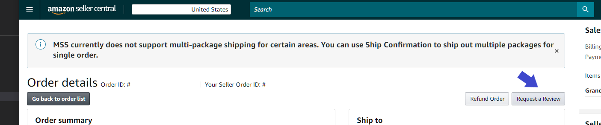

# What is it?
**Review request assistant is a python script (meant to be run as a scheduled lambda) that uses the Seller Partner API functions to automatically request reviews from buyers on Amazon. This is a tool for sellers who normally manually use the `Request Review` button on seller central.** 



Like the request review button you can only request a review once per order. This script will do this automatically for you after the order has passed a certain timeframe (you can set the numbers of days after the order to request the review). This timeframe must be within the 4 to 30 days allowed by Amazon which is the same restriction that applies to the button on the order page.

## Worth Noting
* This script uses AWS resources, specifically lambda compute resources and ddb on-demand resources. It will likely be very cheap but on demand ddb is not free-tier eligible I believe. You could change the table definition if you desire in the code or via the AWS console after creation.
* This script only operates on a single marketplace, specified by `MARKETPLACE_ID` in main.py which is by default set to the US marketplace.
* This script does not differentiate by product type, it will request for all eligible orders using the same day delay. If you want to differentiate by product type you will need to extend the code to maintain some sort of map from product type to eligible order days delay.
* This script introduces artificial delays to stay within the default TPS limitations, namely a 0.1 second delay for the orders API calls and a 1 second delay between each solicitation call.
* This script does use a cache to remember which orders have already been solicited. If the cache is nuked it is not catastrophic, when rerunning over those orders you will receive a 403 from the solicitation API as you have already requested a review for that order. You will just eat a 1 second delay each time and make some extra calls.
* The 4 day minimum on the order window is not enforced in the code anywhere at runtime, so if you do see a bunch of errors you will want to make sure you are not requesting for orders that are too recent. The maximum age of 30 days *is* enforced automatically since the orders API requires a date to search after.
* This script doesn't take any params via the lambda event or any command line params at that, everything is configured via the configuration at the top of `main.py` and the secrets contained in your `secrets.py` that you create from `secrets.template.py` (see instructions below)
* This script is licensed under the MIT license (see LICENSE.txt)

# How to Setup
1. Sign up for [Amazon Selling Partner (SP) API](https://developer.amazonservices.com/) access via your seller central account under [`Apps & Services > Develop Apps`](https://sellercentral.amazon.com/sellingpartner/developerconsole/ref=xx_DevCon_dnav_xx). Make sure you select to allow the `Buyer Solicitation` permission when creating your developer profile.
2. Create a role in IAM in the AWS console that you will assume to execute this script. Attach 3 policies

```
{
    "Version": "2012-10-17",
    "Statement": [
        {
            "Effect": "Allow",
            "Action": "execute-api:Invoke",
            "Resource": "arn:aws:execute-api:*:*:*"
        }
    ]
}
```

Along with `AmazonDynamoDBFullAccess` and `AWSLambdaBasicExecutionRole` and the following trust policy.

```
{
  "Version": "2012-10-17",
  "Statement": [
    {
      "Effect": "Allow",
      "Principal": {
        "AWS": "arn:aws:iam::<your account id>:root"
      },
      "Action": "sts:AssumeRole",
      "Condition": {}
    },
    {
      "Effect": "Allow",
      "Principal": {
        "Service": "lambda.amazonaws.com"
      },
      "Action": "sts:AssumeRole"
    }
  ]
}
```
Replacing `<your account id>` with your 12 digit AWS account id.

3. In this code base, copy `secrets.template.py` to `secrets.py`. We will fill it out in the next step.
4. Go to https://sellercentral.amazon.com/sellingpartner/developerconsole and create a new app.
5. Click `View` under `LWA Credentials` and copy the client identifier and client secret into the `secrets.py`. Under `Actions` dropdown click `Authorize`. This will provide you with a long term refresh token that you can use without going through the OAuth flow. Copy this refresh token to `secrets.py` as the `refresh_token`.
6. Install all dependencies via pip e.g. `pip3 install --target ./package requirements.txt`
7. Use `python3 create_lambda_package.py` to create a Lambda zip file.
8. Create a new Lambda in AWS, selecting the role you create in step 2 as the execution role. *Make sure you set the execution timeout of the lambda to something like 2 minutes instead of the default 3 seconds*. Use the zip file as the lambda code. You may test the lambda to ensure it is working. Note that the test functionality will actually execute the lambda and will schedule any order review requests that meet the guideline. You may check the console output to see which orders were review requested.
9. Create a new rule based event in CloudWatch, using cron expression `0 17 * * ? *`. This will schedule the lambda to run at 10am PST each day. Set the target to the lambda function you created above in 8.